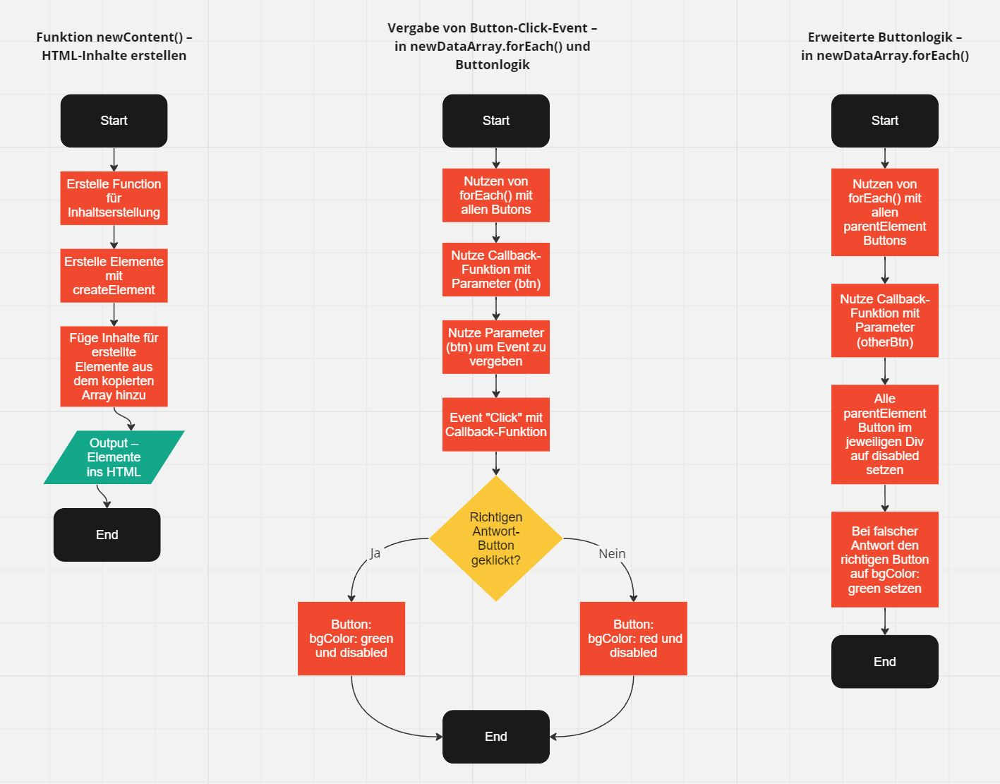

# Quiz – JavaScript-Projekt

## Beschreibung

Dieses JavaScript-Projekt wurde im Rahmen eines Coding-Bootcamps bei supercode.de erstellt. Es handelt sich um ein kleines Quiz, bei dem per JavaScript der Großteil des HTML generiert und der Quiz-Inhalt aus einem Array beim Laden der Seite ausgegeben wird.

### Die Anwendung bietet folgende Möglichkeiten:

- Durchspielen eine Quiz bestehend aus 10 Fragen
- Die richtigen und falsch gegebenen Antworten werden anhand der entsprechenden Buttonfarbe angezeigt.

## Tools/Technologien
- HTML5
- CSS3
- Vanilla JavaScript

## PAP (Programmablaufplan)

1. Start:
- Das Programm wird gestartet.
- Eine Kopie des Original-Arrays data wird erstellt.

2. Quiz-Ausgabe:
- Für jedes Element in newDataArr:
- Ein neues Div wird erstellt.
- Ein Bild und eine Überschrift werden dem Div hinzugefügt.
- Für jede Wahlmöglichkeit wird ein Button erstellt und dem Div hinzugefügt.
- Das Div wird dem HTML-Element mit der ID content hinzugefügt.

3. Antwort-Logik:
- Für jeden Button in der HTML-Seite:
- Ein Klick-Ereignis wird hinzugefügt.
- Überprüfung, ob die ausgewählte Antwort mit der korrekten Antwort übereinstimmt.
- Falls korrekt, wird dem Button die Klasse btnGreen und disabled hinzugefügt.
- Falls falsch, wird dem Button die Klasse btnRed und disabled hinzugefügt.
- Deaktivierung aller anderen Buttons in der gleichen Reihe.
- Falls falsch, wird dem Button mit der richtigen Antwort die Klasse btnGreen hinzugefügt.

4. Ende des Quiz:
- Das Quiz ist abgeschlossen.

## Screenshots

### Flowchart (wird überarbeitet)

### Ansicht der Webseite

## GitHub Live Vorschau

Du findest eine Live Vorschau auf GitHub: [GitHub Live Vorschau](https://w1tch3r-code.github.io/js_quiz/)

## GitHub Repository

Du findest das gesamte Projekt auf GitHub: [GitHub Repository](https://github.com/w1tch3r-code/js_quiz)

## Anmerkungen

- Dieses Projekt wurde im Rahmen eines Coding-Bootcamps bei supercode.de erstellt.
- Mit dieser Anwendung kann man ein kleines Quiz durchspielen, bei dem die richtigen und falsch gegebenen Antworten anhand der Buttonfarbe entsprechend angezeigt werden.
- Die README.md-Datei dient auch als Bewerbungsunterlage und präsentiert meine Fähigkeiten in der Webentwicklung.
